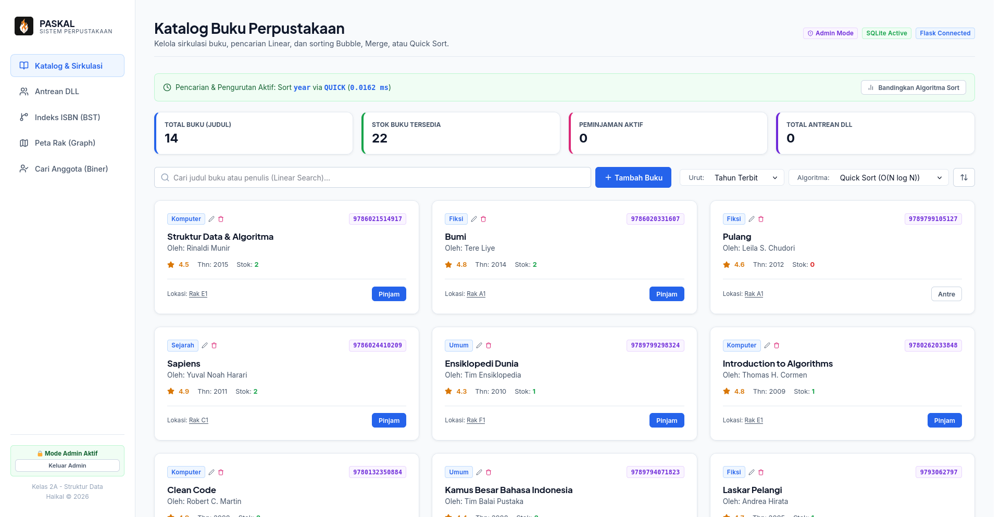
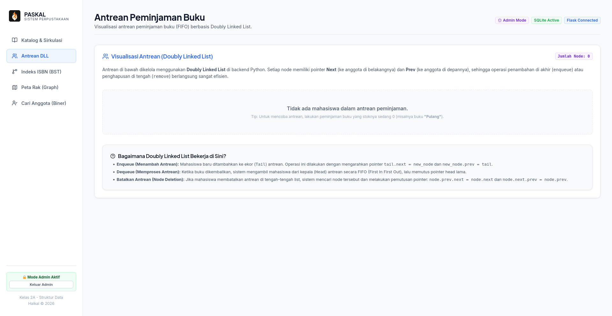
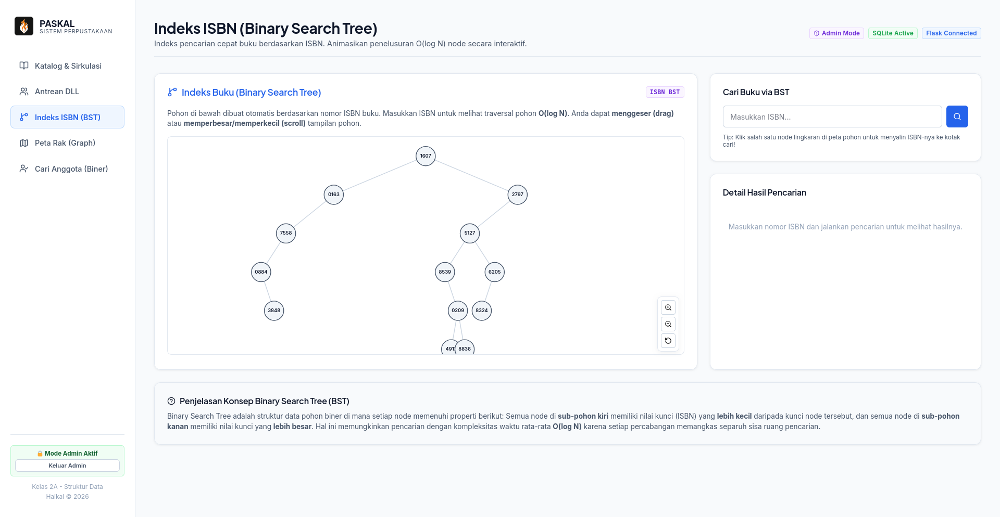
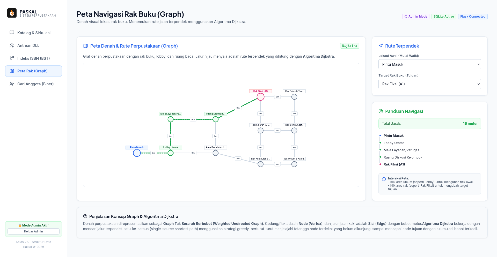
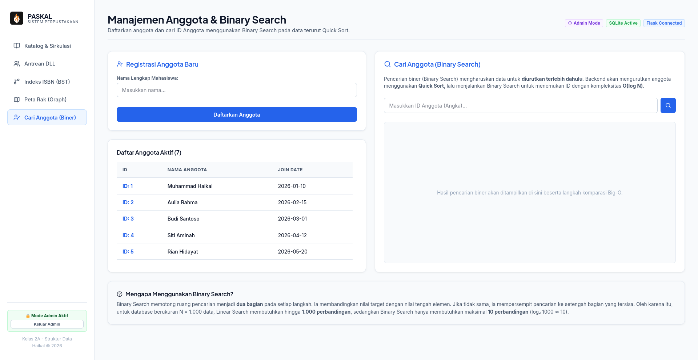

# PASKAL v2.0 - Sistem Informasi Perpustakaan Digital

Aplikasi manajemen perpustakaan digital interaktif bertema profesional yang mengimplementasikan **6 konsep utama Struktur Data & Algoritma (ASD)** secara mandiri (tanpa library struktur data eksternal) untuk Ujian Akhir Semester (UAS).

Aplikasi ini menggunakan stack teknologi modern:
* **Backend**: Python Flask (REST API) + SQLite (Persistensi Data)
* **Frontend**: React JS (Vite) + Vanilla CSS (Glassmorphism & Micro-animations)
* **Peta Navigasi**: Graph & Algoritma Dijkstra
* **Pohon Buku**: Binary Search Tree (BST) untuk indexing ISBN

---

## 📖 Panduan Penggunaan Resmi (PDF)

Dokumen laporan panduan penggunaan resmi sistem perpustakaan PASKAL v2.0 dapat diunduh pada link berikut:
👉 **[Panduan_Cara_Kerja_PASKAL.pdf](Panduan_Cara_Kerja_PASKAL.pdf)**

---

## 🛠️ Prasyarat (Prerequisites)

Pastikan perangkat Anda sudah terinstal:
1. **Python 3.8+** (Unduh di [python.org](https://www.python.org/downloads/))
2. **Node.js 16+ & npm** (Unduh di [nodejs.org](https://nodejs.org/))
3. **Git** (Opsional, untuk kloning)

---

## 📥 Langkah Kloning & Persiapan

Buka terminal (Linux/macOS) atau Command Prompt/PowerShell (Windows) dan jalankan:

```bash
git clone https://github.com/Haikal55/paskal-2.0.git
cd paskal-2.0
```

---

## 🚀 Langkah Instalasi & Menjalankan Aplikasi

### 1. Windows

#### Bagian A: Backend (Flask + SQLite)
1. Buka PowerShell atau Command Prompt di folder `backend/`:
   ```powershell
   cd backend
   ```
2. Buat Virtual Environment (venv):
   ```powershell
   python -m venv venv
   ```
3. Aktifkan venv:
   * **PowerShell**: `.\venv\Scripts\Activate.ps1` (jika diblokir kebijakan eksekusi, jalankan `Set-ExecutionPolicy -ExecutionPolicy RemoteSigned -Scope Process` terlebih dahulu)
   * **Command Prompt**: `.\venv\Scripts\activate.bat`
4. Instal dependency:
   ```powershell
   pip install flask flask-cors fpdf2 selenium
   ```
5. Seed database SQLite (`library.db` otomatis dibuat):
   ```powershell
   python seed.py
   ```
6. Jalankan server backend Flask:
   ```powershell
   python app.py
   ```
   *(Backend berjalan di http://127.0.0.1:5000)*

#### Bagian B: Frontend (React + Vite)
1. Buka terminal/cmd baru di folder `frontend/`:
   ```powershell
   cd frontend
   ```
2. Instal dependency npm:
   ```powershell
   npm install
   ```
3. Jalankan server frontend:
   ```powershell
   npm run dev
   ```
   *(Frontend berjalan di http://localhost:5173. Semua request API ke `/api` otomatis di-proxy ke Flask backend)*

---

### 2. macOS

#### Bagian A: Backend (Flask + SQLite)
1. Buka Terminal di folder `backend/`:
   ```bash
   cd backend
   ```
2. Buat Virtual Environment:
   ```bash
   python3 -m venv venv
   ```
3. Aktifkan venv:
   ```bash
   source venv/bin/activate
   ```
4. Instal dependency:
   ```bash
   pip install flask flask-cors fpdf2 selenium
   ```
5. Seed database:
   ```bash
   python3 seed.py
   ```
6. Jalankan server backend:
   ```bash
   python3 app.py
   ```

#### Bagian B: Frontend (React + Vite)
1. Buka Terminal baru di folder `frontend/`:
   ```bash
   cd frontend
   ```
2. Instal dependency:
   ```bash
   npm install
   ```
3. Jalankan server frontend:
   ```bash
   npm run dev
   ```

---

### 3. Linux (Ubuntu/Debian/Fedora)

Di Linux, Anda bisa menjalankan backend dan frontend secara manual (mengikuti panduan macOS di atas) atau menggunakan **Script Satu Perintah** yang telah disediakan untuk kemudahan:

#### Opsi Otomatis (Menggunakan Script Startup)
1. Buka Terminal di root direktori project (`paskal-2.0/`).
2. Buat script `run.sh` dan `run_ngrok.sh` agar executable:
   ```bash
   chmod +x run.sh run_ngrok.sh
   ```
3. Jalankan aplikasi:
   ```bash
   ./run.sh
   ```
   *Script ini akan otomatis mengaktifkan virtual environment backend, menjalankan Flask, menginstal npm packages di frontend jika belum ada, dan menjalankan server React.*
   *Menekan `Ctrl+C` di terminal ini akan mematikan server backend dan frontend secara bersih.*

---

## 🌐 Publikasi ke Internet via Ngrok

Jika Anda ingin mempublikasikan aplikasi agar bisa diakses oleh dosen/teman melalui HP atau jaringan luar:

1. Dapatkan **Authtoken** Anda dari dashboard [ngrok.com](https://dashboard.ngrok.com/).
2. Konfigurasikan token tersebut di terminal:
   ```bash
   ./ngrok config add-authtoken <TOKEN_ANDA>
   ```
3. Jalankan script ngrok:
   ```bash
   ./run_ngrok.sh
   ```
4. Salin URL publik HTTPS (contoh: `https://xxxx.ngrok-free.app`) yang tampil di layar. URL tersebut siap diakses dari perangkat mana pun selama server lokal Anda tetap menyala!

## 📷 Tangkapan Layar Aplikasi (Screenshots)

Berikut adalah tampilan visualisasi modul-modul utama aplikasi PASKAL yang diambil secara real-time:

1. **Katalog & Sirkulasi Buku (Admin Mode & Statistik)**
   
2. **Antrean Sirkulasi Buku (Doubly Linked List)**
   
3. **Indeks ISBN (Binary Search Tree)**
   
4. **Peta Navigasi Rak (Graph & Dijkstra)**
   
5. **Manajemen Anggota (Binary Search)**
   

---

## 🔐 Akun Administrator Default

Untuk masuk ke **Mode Admin** (menambah, mengedit, dan menghapus buku):
* Klik tombol **🔑 Login Admin** di bagian bawah sidebar.
* Masukkan password: **`admin`**.

---

## ⚖️ Hak Cipta & Lisensi (Copyright & License)

Hak Cipta &copy; 2026 oleh **Haikal**. Seluruh Hak Cipta Dilindungi Undang-Undang.

Proyek ini dilisensikan di bawah [Lisensi MIT](LICENSE). Proyek ini dibangun khusus untuk memenuhi persyaratan penilaian akademis Ujian Akhir Semester (UAS) pada Program Studi Informatika, Universitas Sebelas April.
